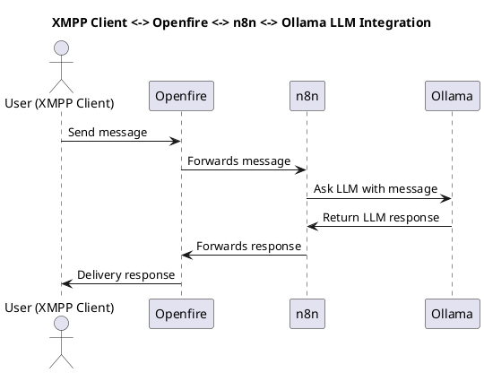

# Chatbot

This document describes a simple example of integrating an XMPP server (Openfire), a workflow automation 
tool (n8n), and a local large language model (LLM) using Ollama, all deployed on a lightweight Kubernetes distribution 
(k3s).

## Requirements

Hardware/network/so requirements

- Minimum 4GB RAM
- Minimum 2 CPU cores
- Minimum 20GB disk (ubuntu + k3s + container images + LLM model)
- Internet access to download container images and LLM model
- Ubuntu 24.04 LTS

## Quick start

Script automation instructions (vm or baremetal)

run the following commands as root inside the machine or vm to deploy the working setup:

```bash
git clone https://github.com/uaiso-serious/infra.git
./infra/_setup/k3s/k3s.sh
./infra/examples/chatbot/chatbot.sh
```

Takes about 10 minutes to download container images and LLM models depending on your internet speed. You can use 
kubectl or k9s command to check the pod status.

Configure your browser to use a http proxy to access the ingress routes, point it to &lt;your-k3s-ipv4&gt; port 3128.

Easy proxy stuff with [FoxyProxy for Chrome](https://chromewebstore.google.com/search/foxyproxy)
or [FoxyProxy for Firefox](https://addons.mozilla.org/en-US/firefox/addon/foxyproxy-standard/)

Open [http://xmpp.uaiso.lan/](http://xmpp.uaiso.lan/) login as admin/admin

Say hi to severino bot.

Congratulations, you have an AI chatbot.

---

## Integration

The architecture looks like this:

XMPP Client <-> Openfire <-> n8n <-> Ollama LLM Integration



When it's running, is possible to "talk" with Ollama using jabber/xmpp client using n8n workflows.

You can use any XMPP client (such as Pidgin, Gajim, Dino, Profanity) to connect to the Openfire server.
Web-xmpp included inside openfire, no need to install xmpp client to test.

A n8n workflow acts as a bridge, receiving messages from the user and sending them to the LLM running on Ollama, then
returning the response directly in the chat.

Don't worry... n8n is not just a bridge, you can create more complex workflows, expose MCP tools to the LLM (like ssh
and playright, custom MCP servers), RAG, VectorDB, and **much more**.

### Why jabber/xmpp?

This is old stuff! What's next? Using irc, or BBS with phone lines?

XMPP is an open standard protocol, and running your own XMPP server gives you full control over your data and privacy.
Don't need to rely on third-party services and their rules and rate limits (and their bad C-level decisions).

Recently, Meta did some changes to their terms of service, saying that it's not allowed to use their whatsapp service
with AI agents. Brazil and Italy blocked that terms of service, so Meta will charge for AI usage in whatsapp.

Discord said that will not allow child accounts, so they had the brilliant idea to ask personal documents to verify the
age of the users.

Telegram can be blocked in some countries, and they had some issues with their bot API in the past.

Also, after installing, your setup is 100% off-grid, no internet required.

But... I like the irc idea... maybe in the future. For now, using profanity xmpp client in terminal is fun enough.

---

It's possible to use another chat integration instead of xmpp/openfire, like discord, slack, telegram, whatsapp, etc.
Just change the n8n workflow to use the desired chat node.

---

## Kubernetes namespace

uaiso deployments/statefulsets details

---

### Ollama

- url: http://ollama-service.uaiso.svc.cluster.local:11434 (k8s internal)
- http ingress: [http://ollama.uaiso.lan](http://ollama.uaiso.lan)
- no apikey

---

### Openfire

- ip: &lt;your-k3s-ipv4&gt;
- url xmpp: [http://xmpp.uaiso.lan/](http://xmpp.uaiso.lan/)
- url adm: [http://xmpp-adm.uaiso.lan/](http://xmpp-adm.uaiso.lan/)
- port: 5222 tcp/xmpp
- user: admin
- password: admin

using restApi plugin:

readiness check:

```bash
curl 'http://xmpp-adm.uaiso.lan/plugins/restapi/v1/system/readiness' -v
```

create user example mybot:

```bash
curl \
  'http://xmpp-adm.uaiso.lan/plugins/restapi/v1/users' \
  -H 'Authorization: secretkey123' \
  -H 'Content-Type: application/json' \
  -d '{"username": "mybot","password": "123"}'
```

add roster entry (friend mybot to admin):

```bash
curl \
  'http://xmpp-adm.uaiso.lan/plugins/restapi/v1/users/admin/roster' \
  -H 'accept: */*' \
  -H 'Authorization: secretkey123' \
  -H 'Content-Type: application/json' \
  -d '{"jid": "mybot@xmpp.uaiso.lan","nickname": "mybot","subscriptionType": 1}'
```

Openfire admin panel (clickops):

- url adm: [http://xmpp-adm.uaiso.lan/](http://xmpp-adm.uaiso.lan/)
- user: admin
- password: admin

---

### RabbitMQ

- dns: rabbitmq-lb.uaiso.svc.cluster.local (k8s internal)
- port: 5672 tcp/ampq
- url management: [http://rabbitmq.uaiso.lan](http://rabbitmq.uaiso.lan)
- user: user
- password: password
- vhost: /

---

### n8n

[http://n8n.uaiso.lan/](http://n8n.uaiso.lan/)

- email: admin@uaiso.lan
- password: Admin123
